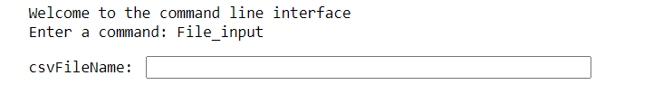
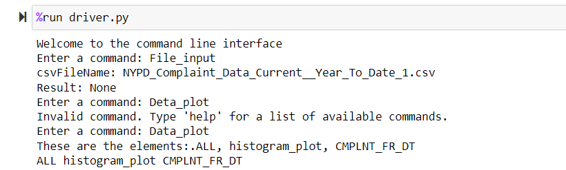
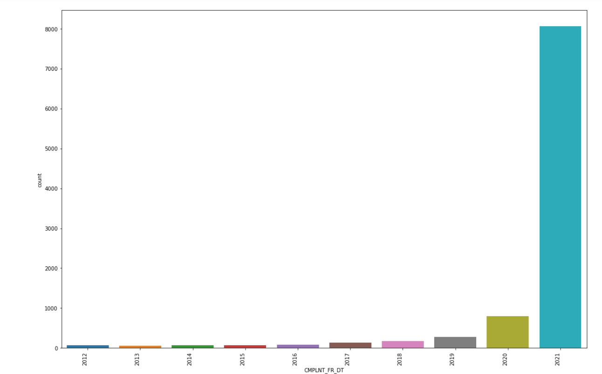
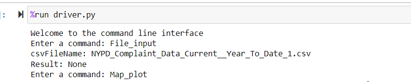
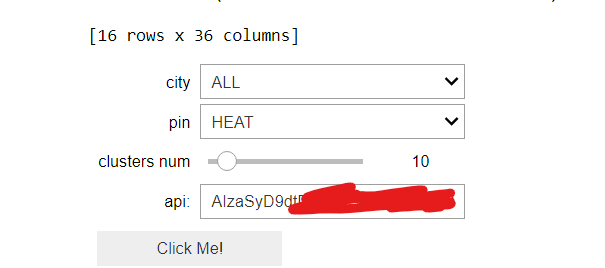
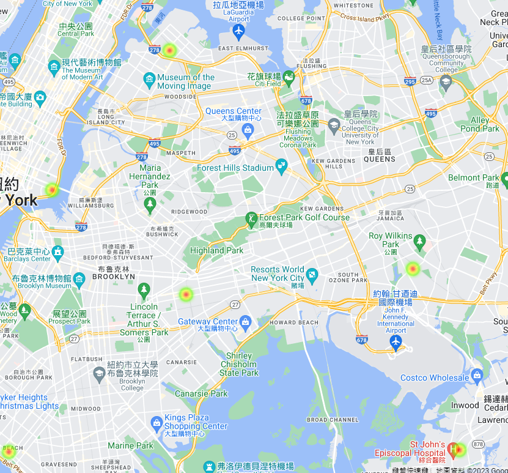

# Software_Engineering_Final_Project

First you need to run  
pip install -r requirement.txt  
to install all the required packages  

Run driver.py File:  
    Use command "File_input" first: input the name of file  
    Then use command "Data_plot" to choose what kind of plot you want.  
    It will pop out a window for you to make the choice.  
    After making the choice, it will show you the plot.  
    Also you can try other commends with "help"  

UI-
import dropdownmenu class and run function UI 

build html:
go under ./doc/
type command "$ make html"
Enter a command : quit
then wait for generating html

  
  
  
  
  
  
  
